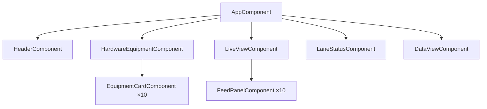

# Smart Lane Monitoring & Toll Operations Dashboard — Implementation Plan

## 1. Overview & Goals

Build a **pixel-accurate, single-page dashboard** for lane management and monitoring in intelligent transportation / tolling operations, faithfully recreating the design shown in the reference screenshot and fulfilling every requirement in the Product Design Document (PDD v1.0).

**Core Objective:** A production-grade, visually stunning Angular SPA that an operator can use to monitor hardware health, live sensor feeds, lane status, and vehicle transaction data — all within a single browser viewport on desktop with no page-level scrolling.

---

## 2. Technology Stack

| Layer | Choice | Version | Rationale |
|---|---|---|---|
| Framework | **Angular** | **21.x** | Latest stable with signals, standalone components, zoneless change detection by default |
| CLI | **Angular CLI** | **21.x** | Project scaffolding, dev server, builds |
| Styling | **Tailwind CSS** | **v4.3** | CSS-first config, Rust-based engine (Lightning CSS), utility-first rapid styling |
| Language | **TypeScript** | 5.7+ | Type safety, Angular requirement |
| Fonts | **Google Fonts — Inter** | Latest | Matches the clean, modern UI in the reference |
| Icons | **Lucide Angular** | Latest | Lightweight SVG icons, matches the line-icon style in the design |
| Testing | **Vitest** | Default in Angular 21 | Fast, built-in |

### Angular 21 Features We'll Leverage
- **Standalone Components** — no NgModules, each component is self-contained
- **Signals** — reactive state management for device statuses, live clock, tab selection
- **Zoneless Change Detection** — default in Angular 21, better performance
- **`@for` / `@if` / `@switch`** — modern template control flow (no `*ngFor` / `*ngIf`)
- **OnPush Change Detection** — standard strategy with signals

### Tailwind CSS v4.3 Setup
- **CSS-first configuration** — no `tailwind.config.js` needed
- **`@import "tailwindcss"`** in `styles.css`
- **`@theme` directive** for custom design tokens
- **PostCSS plugin** via `@tailwindcss/postcss`

> [!NOTE]
> No backend or API is required. All data (hardware metrics, vehicle records, live feed metadata) will be **simulated with realistic static/mock data** and Angular signals with `setInterval` for the "live" feel.

---

## 3. Reference UI — Section-by-Section Breakdown

The screenshot reveals **5 vertically stacked sections** inside a single viewport:

### 3.1 Top Header Bar
- **Left:** Logo icon (blue "U" shape) + "Lane 1" title + version `v1.0.23`
- **Center-left card:** Lane selector dropdown (`Lane 1 ▼`), Status (`Active ●`), Date & Time (`07 May 2025, 07:05:38 PM`)
- **Center-right card:** API status + Restart btn, Uploader status + Restart btn, Server status + Restart btn
- **Right:** Notification bell with red badge count (`3`), User avatar + name (`John Doe ▼`)

### 3.2 Hardware Equipment Section
- Section header: gear icon + "Hardware Equipment" + "View All Equipment >" link (right-aligned)
- **Two rows** (Lane 1 and Lane 2), each containing **5 equipment cards** side by side:
  1. **RFID Reader** — Status, Latency (ms), Last Sync
  2. **ANPR Front Camera** — Status, Resolution, FPS
  3. **ANPR Back Camera** — Status, Resolution, FPS
  4. **4D Radar Sensor** — Status, Range, Max Range, Last Sync
  5. **3D LiDAR Sensor** — Status, Range, Last Sync
- Each card has: icon (circular blue bg), device name, green "Active" badge, metric labels/values, and a "↻ Restart" button

### 3.3 Live View Section
- Section header: camera icon + "Live View" + green "● LIVE" badge + "Open All" button + fullscreen icon (right-aligned)
- **Two rows** (Lane 1 and Lane 2), each containing **5 feed panels**:
  1. ANPR Front — camera feed image, "LIVE" red badge, Resolution info, timestamp overlay, fullscreen icon
  2. ANPR Back — same pattern
  3. Surveillance Camera — same pattern
  4. 4D Radar View — "LIVE" badge, Latency info instead of Resolution
  5. 3D LiDAR View — "LIVE" badge, Latency info
- Lane label rotated vertically on the left side ("Lane 1", "Lane 2")
- Each panel has dark overlay with camera name + timestamp at top, "LIVE" badge + info at bottom

### 3.4 Lane Status Section
- Section header: "Lane Status"
- **Horizontal row of 10 device status chips**: RFID 1, RFID 2, ANPR Front 1, ANPR Front 2, ANPR Back 1, ANPR Back 2, 4D Radar 1, 4D Radar 2, 3D LiDAR 1, 3D LiDAR 2
- Each chip: device icon + name + "Active ●" with green dot

### 3.5 Data View Section
- Section header: "Data View" (left)
- **Tab bar:** ANPR Front 1 (active/selected — filled blue), ANPR Front 2, ANPR Back 1, ANPR Back 2, 4D Radar 1, 4D Radar 2, 3D LiDAR 1, 3D LiDAR 2
- **Right side of tab bar:** Search input, Filters button, Export button
- **Data table columns:** Timestamp, Lane, Direction, Plate Number, Vehicle Type (with icon), Vehicle Class, Speed (km/h), Length (m), Axles, Confidence (%), Payment Status, Snapshot (thumbnail), Actions (⋮)
- 5 sample rows of realistic vehicle data
- Plate numbers are blue/linked
- Confidence values are green (high %)
- Payment Status shows "Paid" in green

---

## 4. Angular Project Architecture

### 4.1 Project Structure

```
mlff-lane/
├── angular.json
├── package.json
├── tsconfig.json
├── tsconfig.app.json
├── .postcssrc.json                          # Tailwind PostCSS config
├── src/
│   ├── index.html
│   ├── main.ts                              # Bootstrap standalone AppComponent
│   ├── styles.css                           # Global styles + Tailwind import + @theme
│   ├── app/
│   │   ├── app.component.ts                 # Root layout component
│   │   ├── app.component.html               # Main dashboard layout template
│   │   ├── app.component.css                # Root-level custom styles
│   │   │
│   │   ├── components/
│   │   │   ├── header/
│   │   │   │   ├── header.component.ts      # Top header bar
│   │   │   │   ├── header.component.html
│   │   │   │   └── header.component.css
│   │   │   │
│   │   │   ├── hardware-equipment/
│   │   │   │   ├── hardware-equipment.component.ts
│   │   │   │   ├── hardware-equipment.component.html
│   │   │   │   ├── hardware-equipment.component.css
│   │   │   │   └── equipment-card/
│   │   │   │       ├── equipment-card.component.ts   # Reusable card
│   │   │   │       ├── equipment-card.component.html
│   │   │   │       └── equipment-card.component.css
│   │   │   │
│   │   │   ├── live-view/
│   │   │   │   ├── live-view.component.ts
│   │   │   │   ├── live-view.component.html
│   │   │   │   ├── live-view.component.css
│   │   │   │   └── feed-panel/
│   │   │   │       ├── feed-panel.component.ts       # Reusable feed tile
│   │   │   │       ├── feed-panel.component.html
│   │   │   │       └── feed-panel.component.css
│   │   │   │
│   │   │   ├── lane-status/
│   │   │   │   ├── lane-status.component.ts
│   │   │   │   ├── lane-status.component.html
│   │   │   │   └── lane-status.component.css
│   │   │   │
│   │   │   └── data-view/
│   │   │       ├── data-view.component.ts
│   │   │       ├── data-view.component.html
│   │   │       └── data-view.component.css
│   │   │
│   │   ├── services/
│   │   │   ├── lane.service.ts              # Lane selection state, config
│   │   │   ├── hardware.service.ts          # Hardware device data & status
│   │   │   ├── live-feed.service.ts         # Live feed metadata
│   │   │   ├── vehicle-data.service.ts      # Vehicle transaction records
│   │   │   └── clock.service.ts             # Real-time clock signal
│   │   │
│   │   ├── models/
│   │   │   ├── hardware-device.model.ts     # Device interfaces
│   │   │   ├── vehicle-record.model.ts      # Vehicle transaction interface
│   │   │   ├── live-feed.model.ts           # Feed panel interface
│   │   │   └── lane.model.ts               # Lane config interface
│   │   │
│   │   └── data/
│   │       └── mock-data.ts                 # All mock/seed data
│   │
│   └── assets/
│       ├── icons/                           # SVG icons for devices
│       └── feeds/                           # AI-generated feed images
```

### 4.2 Component Hierarchy



### 4.3 Angular Services (Signal-Based)

| Service | Responsibility | Key Signals |
|---|---|---|
| `ClockService` | Real-time clock updated every second | `currentTime: Signal<Date>` |
| `LaneService` | Active lane selection, lane config | `selectedLane: WritableSignal<string>`, `lanes: Signal<Lane[]>` |
| `HardwareService` | Device data, status, restart actions | `devices: Signal<HardwareDevice[]>`, `restartDevice(id)` |
| `LiveFeedService` | Feed metadata, fullscreen state | `feeds: Signal<LiveFeed[]>` |
| `VehicleDataService` | Vehicle records, search, filter, tab | `records: Signal<VehicleRecord[]>`, `activeTab: WritableSignal<string>`, `searchQuery: WritableSignal<string>`, `filteredRecords: computed()` |

### 4.4 Component Details

#### `HeaderComponent` (standalone)
- **Inputs:** None (injects `ClockService`, `LaneService`)
- **Template:** Flex row with logo, lane dropdown, status cards, service indicators, notification bell, user avatar
- **Signals:** `currentTime`, `selectedLane`, `serviceStatuses`
- **Interactions:** Lane dropdown toggle, restart buttons with spin animation, notification badge

#### `EquipmentCardComponent` (standalone, reusable)
- **Inputs:** `@input() device: HardwareDevice`
- **Template:** Card with icon, title, status badge, metric key-value pairs, restart button
- **Interactions:** Restart button click → spin animation → status feedback

#### `FeedPanelComponent` (standalone, reusable)
- **Inputs:** `@input() feed: LiveFeed`
- **Template:** Image container with dark gradient overlay, camera name, timestamp, LIVE badge, resolution/latency info, fullscreen icon
- **Interactions:** Fullscreen toggle via `Element.requestFullscreen()`

#### `DataViewComponent` (standalone)
- **Inputs:** None (injects `VehicleDataService`)
- **Template:** Tab bar, search/filter/export toolbar, data table
- **Signals:** `activeTab`, `searchQuery`, `filteredRecords`
- **Interactions:** Tab switching, search filtering, export (CSV download), row actions menu

---

## 5. Tailwind CSS v4.3 — Design Token Configuration

### 5.1 `styles.css` — Global Theme

```css
@import "tailwindcss";

@theme {
  /* === Colors === */
  --color-primary: #1a3ab5;
  --color-primary-dark: #142d8c;
  --color-primary-light: #e8ecfa;
  --color-primary-50: #f0f3ff;
  --color-success: #22c55e;
  --color-success-light: #dcfce7;
  --color-danger: #ef4444;
  --color-danger-light: #fee2e2;
  --color-warning: #f59e0b;
  --color-bg-page: #f0f2f8;
  --color-bg-card: #ffffff;
  --color-bg-dark: #0f172a;
  --color-bg-overlay: rgba(15, 23, 42, 0.7);
  --color-text-primary: #1e293b;
  --color-text-secondary: #64748b;
  --color-text-muted: #94a3b8;
  --color-border: #e2e8f0;
  --color-border-hover: #cbd5e1;

  /* === Typography === */
  --font-sans: 'Inter', system-ui, sans-serif;

  /* === Spacing === */
  --spacing-section: 10px;
  --spacing-card: 12px;

  /* === Radius === */
  --radius-card: 10px;
  --radius-badge: 20px;
  --radius-button: 6px;

  /* === Shadows === */
  --shadow-card: 0 1px 3px rgba(0, 0, 0, 0.08);
  --shadow-card-hover: 0 4px 12px rgba(0, 0, 0, 0.12);
  --shadow-header: 0 2px 8px rgba(0, 0, 0, 0.06);
}
```

### 5.2 Key Tailwind Utility Patterns

| UI Element | Tailwind Classes (examples) |
|---|---|
| Section container | `bg-bg-card rounded-card border border-border p-card shadow-card` |
| Active status badge | `text-xs font-semibold text-success flex items-center gap-1` |
| LIVE badge | `bg-danger text-white text-[10px] font-bold px-2 py-0.5 rounded-badge animate-pulse` |
| Primary button | `bg-primary text-white px-3 py-1.5 rounded-button text-xs font-medium hover:bg-primary-dark transition-all` |
| Card title | `text-[13px] font-semibold text-text-primary` |
| Metric label | `text-[11px] text-text-secondary` |
| Metric value | `text-[12px] font-medium text-text-primary` |
| Table header | `text-[12px] font-semibold text-text-secondary uppercase tracking-wide` |

### 5.3 Custom CSS (Component-Level)

Tailwind handles ~90% of styling. The remaining ~10% uses component `.css` files for:
- Complex animations (LIVE pulse glow, restart spin, status dot pulse)
- Vertical text rotation (`writing-mode: vertical-rl`) for lane labels
- Feed panel aspect-ratio and overlay gradients
- Table-specific fine-tuning
- `100vh` viewport fitting layout

---

## 6. Data Models (`models/`)

### `hardware-device.model.ts`
```typescript
export interface HardwareDevice {
  id: string;
  name: string;               // "RFID Reader", "ANPR Front Camera", etc.
  type: 'rfid' | 'anpr-front' | 'anpr-back' | 'radar-4d' | 'lidar-3d';
  lane: number;               // 1 or 2
  status: 'active' | 'inactive' | 'error';
  icon: string;               // SVG path or Lucide icon name
  metrics: DeviceMetric[];    // Latency, FPS, Resolution, Range, etc.
  lastSync?: string;
}

export interface DeviceMetric {
  label: string;              // "Latency", "Resolution", "FPS", "Range"
  value: string;              // "23 ms", "1920 x 1080", "30", "1 - 250 m"
}
```

### `vehicle-record.model.ts`
```typescript
export interface VehicleRecord {
  timestamp: string;
  lane: number;
  direction: 'Inbound' | 'Outbound';
  plateNumber: string;
  vehicleType: 'Car' | 'SUV' | 'Truck' | 'Bus' | 'Motorcycle';
  vehicleClass: string;
  speed: number;              // km/h
  length: number;             // meters
  axles: number;
  confidence: number;         // percentage
  paymentStatus: 'Paid' | 'Unpaid' | 'Pending';
  snapshotUrl: string;
}
```

### `live-feed.model.ts`
```typescript
export interface LiveFeed {
  id: string;
  name: string;               // "ANPR Front", "Surveillance Camera", etc.
  type: 'anpr-front' | 'anpr-back' | 'surveillance' | 'radar-4d' | 'lidar-3d';
  lane: number;
  imageUrl: string;
  isLive: boolean;
  resolution?: string;        // "1920 x 1080"
  latency?: string;           // "1 ms"
  timestamp: string;
}
```

---

## 7. Responsive Strategy

### Desktop/Laptop (≥ 1440px) — **PRIMARY TARGET**
- **`height: 100vh`** on the main container — **NO page-level scrolling**
- CSS Grid for the main layout: `grid-template-rows` carefully proportioned
- Equipment cards: 5 across per lane row using `grid-cols-5`
- Live feeds: 5 across per lane row
- Data table: full-width with all 13 columns visible
- Font sizes and spacing tightened to fit all content

### Tablet (768px – 1439px)
- Vertical scrolling enabled (`overflow-y: auto`)
- Equipment cards: `grid-cols-3` → wrap to additional rows
- Live feeds: `grid-cols-3` → wrap
- Data table: horizontal scroll (`overflow-x: auto`)

### Mobile (< 768px)
- Full vertical scroll
- Equipment cards: `grid-cols-1` (stacked)
- Live feeds: `grid-cols-1`
- Lane status: horizontal scroll strip
- Data table: responsive card view or horizontal scroll

---

## 8. Micro-Animations & Polish

| Element | Animation | Tailwind / CSS |
|---|---|---|
| Status dots (Active) | Gentle pulse | Custom CSS `@keyframes pulse-dot` |
| LIVE badge | Pulsing red glow | `animate-pulse` + custom `box-shadow` animation |
| Restart button click | Rotate icon 360° | Custom CSS `@keyframes spin-once`, triggered on click via Angular |
| Button hover | Scale + shadow lift | `hover:scale-[1.02] hover:shadow-card-hover transition-all duration-200` |
| Card hover | Border highlight + shadow | `hover:border-border-hover hover:shadow-card-hover transition-all` |
| Tab switch | Background color transition | `transition-colors duration-200` |
| Table row hover | Background highlight | `hover:bg-primary-50 transition-colors` |
| Notification bell | Subtle bounce on new | Custom CSS `@keyframes bell-shake` |
| Feed panel hover | Slight zoom on image | `hover:scale-[1.02] transition-transform` |

---

## 9. AI-Generated Assets

The following images will be generated using `generate_image` for the Live View and Data View sections:

| Image | Description |
|---|---|
| `highway_anpr_front` | Highway overhead camera view — vehicles approaching a toll gantry, dusk lighting |
| `highway_anpr_back` | Highway rear camera view — vehicles departing |
| `highway_surveillance` | Wide-angle highway surveillance camera view |
| `radar_4d_view` | 4D radar point cloud visualization of highway traffic (dark bg, colored points) |
| `lidar_3d_view` | 3D LiDAR point cloud scan of vehicles on highway (dark bg, green/blue points) |
| `vehicle_snapshots` | Small thumbnail captures of individual vehicles for Data View table |

---

## 10. User Review Required

> [!IMPORTANT]
> **Angular version:** You requested Angular 21.2. Angular 21 is the current LTS (Angular 22 is the latest stable as of May 2026). I'll install Angular CLI and scaffold with `@angular/cli@21` to pin to v21.x. Please confirm this is correct.

> [!IMPORTANT]
> **Tailwind CSS v4.3:** This uses the new CSS-first `@theme` configuration approach — no `tailwind.config.js` file. The setup is simpler but different from Tailwind v3. Confirming you're okay with v4.

> [!IMPORTANT]
> **Single-page no-scroll layout:** On desktop (≥ 1440px), all sections must be visible without scrolling. This constrains every section's height and requires careful proportioning using `100vh` and CSS Grid row distribution. Please confirm.

> [!IMPORTANT]
> **Data is fully simulated:** No backend, no WebSocket, no real camera feeds. All data is hardcoded mock data with Angular signals + `setInterval` for the live clock and LIVE badge animation. Is this acceptable for the current phase?

---

## 11. Open Questions

> [!NOTE]
> 1. **Device icons:** The reference uses specific circular icons for each device (RFID, ANPR camera, radar, LiDAR). Should I use Lucide Angular icons (closest match), or create custom SVGs?

> [!NOTE]
> 2. **Notifications panel:** The bell icon shows "3" notifications. Should clicking it open a dropdown with sample notifications, or is the badge count sufficient for now?

> [!NOTE]
> 3. **"View All Equipment" link:** Should this navigate somewhere, open a modal, or be a non-functional placeholder?

> [!NOTE]
> 4. **Export functionality:** Should the Export button trigger a real CSV download of the mock data, or be a visual placeholder only?

> [!NOTE]
> 5. **Target minimum resolution:** The no-scroll requirement works best at 1920×1080. Should I also target 1440×900 as the minimum, or is 1080p the baseline?

> [!NOTE]
> 6. **Routing:** Since this is a single-page dashboard, should the Angular Router be configured for potential future multi-page navigation (e.g., `/dashboard`, `/settings`), or skip routing entirely?

---

## 12. Verification Plan

### Automated / Self-Verified
- `ng serve` launches without errors
- All 5 sections render correctly in the browser
- Layout fits within a single viewport at 1920×1080 (no scrollbar)
- Live clock signal updates every second
- Tab switching in Data View works reactively
- Search input filters mock data in real-time
- Restart buttons show visual feedback (spin animation)
- LIVE badges pulse with animation
- Responsive behavior verified at 768px and 375px widths
- All components are standalone (no NgModules)
- Tailwind classes compile correctly with v4 `@theme` tokens

### Manual Verification (User)
- Visual comparison with [lane application.png](file:///c:/Users/nishk/OneDrive/Desktop/mlff%20lane/lane%20application.png) reference
- Overall aesthetic quality and polish
- Interaction feel (hover effects, animations, transitions)
- Responsive layout on actual tablet/mobile devices

---

## 13. Implementation Sequence

| Phase | Tasks | Key Files |
|---|---|---|
| **Phase 1** | Angular 21 project scaffolding + Tailwind CSS v4.3 setup | `ng new`, `package.json`, `.postcssrc.json`, `styles.css` |
| **Phase 2** | Data models + mock data + services | `models/`, `data/mock-data.ts`, `services/` |
| **Phase 3** | Top Header component | `header/` |
| **Phase 4** | Hardware Equipment section + EquipmentCard | `hardware-equipment/`, `equipment-card/` |
| **Phase 5** | Generate AI images for live feeds | `assets/feeds/` (5–6 images) |
| **Phase 6** | Live View section + FeedPanel | `live-view/`, `feed-panel/` |
| **Phase 7** | Lane Status section | `lane-status/` |
| **Phase 8** | Data View section (table, tabs, search, filter, export) | `data-view/` |
| **Phase 9** | Micro-animations, hover effects, polish | All component CSS files |
| **Phase 10** | Responsive breakpoints + final testing | All templates + `styles.css` |

---

## 14. Setup Commands (Phase 1)

```bash
# 1. Install Angular CLI v21
npm install -g @angular/cli@21

# 2. Create project (non-interactive)
ng new mlff-lane --defaults --style=css --ssr=false --skip-tests

# 3. Install Tailwind CSS v4
cd mlff-lane
npm install tailwindcss @tailwindcss/postcss

# 4. Install Lucide Angular
npm install lucide-angular

# 5. Create PostCSS config (.postcssrc.json)
# { "plugins": { "@tailwindcss/postcss": {} } }

# 6. Add @import "tailwindcss" + @theme to src/styles.css

# 7. Start dev server
ng serve
```
